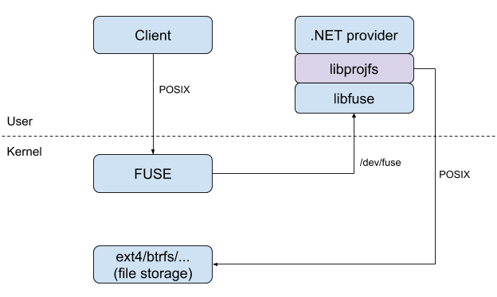

# libprojfs

A Linux projected filesystem library, similar in concept to the Windows
[Projected File System][winprojfs] and developed in conjunction with the
[VFSForGit][vfs4git] project.

While the libprojfs C library may also be used independently of VFSForGit,
our primary goal is to enable users to run the VFSForGit client
on a Linux system.

**PLEASE NOTE:**
At present libprojfs is undergoing rapid development and its design
and APIs may change significantly; some features are also incomplete,
and so we do not recommend libprojfs for any production environments.

However, we wanted to share our progress to date, and we hope others
are as excited as we are at the prospect of running the VFSForGit
client on Linux in the not-too-distant future!

## Current Status

| Branch     | Functional Tests                                          |
| :--------: | :-------------------------------------------------------: |
| **master** | [![CI status: master][ci-master-status]][ci-master-redir] |

The library is under active development and supports basic
directory projection, with additional features added regularly.

We will only make a first, official versioned release once initial
development is complete.

A libprojfs filesystem can currently be used to mount a VFSForGit
[`MirrorProvider`][vfs4git-mirror] test client; we expect to continue our
pre-release development until the VFSForGit client proper is also
functional with libprojfs, at which point we may make an initial
tagged release.

## Design

The libprojfs library is designed to function as a stackable Linux
filesystem supporting a "provider" process which implements custom
callbacks to populate files and directories on demand.  This is
illustrated in the context of a VFSForGit provider below:

Actual file storage is delegated to a "lower" storage filesystem,
which may be any Linux filesystem, e.g., ext4.  At the time
when a libprojfs filesystem mount is created, there may be no
files or directories in the lower filesystem yet.

As normal filesystem requests are made within the libprojfs mount
(e.g., by `ls` or `cat`), libprojfs intercepts the requests
and queries the provider process for the actual contents of the
file or directory.  The provider's response is then written to
the lower filesystem so future accesses may be satisfied without
querying the provider again.

See our [design document][design-linux] for more details.

We anticipate that whether libprojfs remains a [FUSE][fuse-man]-based
library, or becomes a [libfuse][libfuse]-like interface to a Linux kernel
module, it may be useful for purposes other than running a VFSForGit
client.

For this reason, we have tried to ensure that our native
[event notification API](include/projfs_notify.h)
is aligned closely with the Linux kernel's
[fanotify][fanotify]/[inotify][inotify]/[fsnotify][fsnotify] APIs.

## Getting Started

Please see our detailed [Build and Installation][build]
page for step-by-step instructions on how to build and install
libprojfs and its depedencies on Linux, and (optionally) also build and
run the VFSForGit `MirrorProvider` test utility with libprojfs.

So long as libprojfs remains based on [FUSE][fuse-man], the primary
depedency for libprojfs is the user-space [libfuse][libfuse] library,
as well as having the Linux [`fuse`][fuse-mod] kernel module installed.

Support for [`user.*` extended attributes][xattr] must also be enabled
on the "lower" storage filesystem.  Your Linux kernel should have
been compiled with the necessary configuration options (e.g.,
`CONFIG_EXT2_FS_XATTR` for [ext2/3/4][ext2]) and the underlying filesystem
you use for libprojfs should be mounted with appropriate settings
(e.g., [user_xattr][xattr-ext2] for ext2/3/4).

If you are using a [Docker](https://www.docker.com) container, you
may need to ensure the `fuse` kernel module is installed on your
host OS, and `user.*` extended attributes are supported on your host's
filesystem.  See the [Using Docker containers][build-docker] section for
more details.

To test libprojfs with the Microsoft VFSForGit `MirrorProvider`
(as we do not support the primary VFSForGit GVFS provider yet), .NET Core
must be installed and parts of the VFSForGit project built.  See the
[Building and Running MirrorProvider][build-mirror] section for details.

## Contributing

Thank you for your interest in libprojfs!

We welcome contributions; please see our [CONTRIBUTING](CONTRIBUTING.md)
guidelines and our contributor [CODE_OF_CONDUCT](CODE_OF_CONDUCT.md).

## Licensing

The libprojfs library is licensed under the [LGPL v2.1](COPYING).

See the [NOTICE](NOTICE) file for a list of other licenses used in the
project, and the comments in each file for the licenses applicable to them.

## Development Roadmap

We are developing the libprojfs library first, using FUSE to prototype and
test its performance, before migrating functionality into a Linux kernel
module (assuming that proves to be necessary to meet our performance
criteria).

For more details on the planned development phases, see our
[design document][design-process].

## Authors

The libprojfs library is currently maintained and developed by
several members of GitHub's Engineering organization, including:

* [@chrisd8088](https://github.com/chrisd8088)
* [@kivikakk](https://github.com/kivikakk)
* [@wrighty](https://github.com/wrighty)

You can also contact the GitHub project team at
[opensource+libprojfs@github.com](mailto:opensource+libprojfs@github.com).

[build]: docs/build-install.md
[build-docker]: docs/build-install.md#using-docker-containers
[build-mirror]: docs/build-install.md#building-and-running-mirrorprovider
[ci-master-redir]: https://dev.azure.com/asconnor/asconnor/_build/latest?definitionId=1&branchName=master
[ci-master-status]: https://dev.azure.com/asconnor/asconnor/_apis/build/status/github.libprojfs?branchName=master
[design-linux]: docs/design.md#vfsforgit-on-linux
[design-process]: docs/design.md#development-process
[ext2]: https://www.kernel.org/doc/Documentation/filesystems/ext2.txt
[fanotify]: https://github.com/torvalds/linux/blob/master/include/uapi/linux/fanotify.h
[fsnotify]: https://github.com/torvalds/linux/blob/master/include/linux/fsnotify_backend.h
[fuse-man]: http://man7.org/linux/man-pages/man4/fuse.4.html
[fuse-mod]: https://www.kernel.org/doc/Documentation/filesystems/fuse.txt
[inotify]: https://github.com/torvalds/linux/blob/master/include/uapi/linux/inotify.h
[libfuse]: https://github.com/libfuse/libfuse
[winprojfs]: https://docs.microsoft.com/en-us/windows/desktop/api/_projfs/
[vfs4git]: https://github.com/Microsoft/VFSForGit
[vfs4git-mirror]: https://github.com/Microsoft/VFSForGit/tree/features/linuxprototype/MirrorProvider
[xattr]: http://man7.org/linux/man-pages/man7/xattr.7.html
[xattr-ext2]: http://man7.org/linux/man-pages/man5/ext4.5.html#MOUNT_OPTIONS
