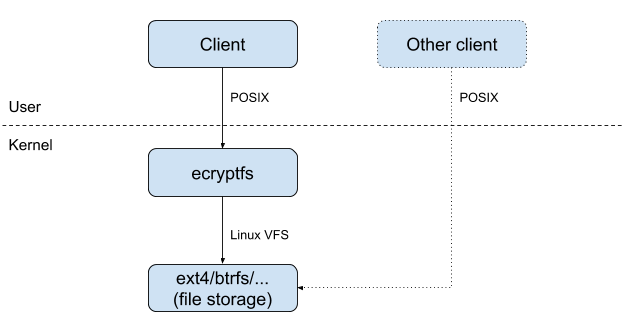

# VFSForGit Linux Client Design

* [Scope](#scope)
* [Overview](#overview)
  * [VFSForGit on Windows](#vfsforgit-on-windows)
  * [VFSForGit on MacOS](#vfsforgit-on-macos)
  * [VFSForGit on Linux](#vfsforgit-on-linux)
* [projfs Kernel Module](#projfs-kernel-module)
  * [Stackable File Systems](#stackable-file-systems)
  * [Mount Points](#mount-points)
  * [Inode Mapping](#inode-mapping)
  * [Relative Paths](#relative-paths)
  * [Communication Channel](#communication-channel)
  * [Callbacks and Notifications](#callbacks-and-notifications)
  * [Extended Attributes](#extended-attributes)
* [Development Process](#development-process)
  * [Phase 1 – FUSE User Mode](#phase-1--fuse-user-mode)
  * [Phase 2 – Hybrid](#phase-2--hybrid)
  * [Phase 3 – Kernel Module](#phase-3--kernel-module)
* [Distribution](#distribution)
  * [Naming](#naming)

## Scope

This document describes the architecture of the Linux port of the VFSForGit
client and projected filesystem, and some of the expected development roadmap
for these components.  While we intend to keep this document reasonably
up-to-date, it is always advisable to check the current state of the code in
the
[`features/linuxprototype`](https://github.com/Microsoft/VFSForGit/tree/features/linuxprototype)
branch of the VFSForGit repository, and in the
[libprojfs](https://github.com/github/libprojfs) repository.

## Overview

### VFSForGit on Windows

The client-side Windows architecture of a virtualized git working tree includes three components:

* [Windows Projected File
  System](https://docs.microsoft.com/en-us/windows/desktop/api/_projfs/),
  including the PrjFlt kernel-mode NTFS filter driver, and the ProjectedFSLib
  user-space library to interact with the driver.
* [VFSForGit](https://github.com/Microsoft/VFSForGit), including the GVFS
  provider which provides callbacks via the ProjFS library to the PrjFlt filter
  driver, as well as scripts which are installed as git hooks.
* [Git for Windows](https://gitforwindows.org/) with
  [GVFS](https://github.com/Microsoft/git/tree/gvfs) patches, which functions
  as a normal git client but with adjustments for a virtualized working tree.


The Windows design projects the external git repository into the virtualized
working tree by moving files through [five
states](https://docs.microsoft.com/en-us/azure/devops/learn/git/gvfs-architecture#virtual-file-system-objects):

* Virtual: file exists as metadata only in the GVFS provider, not on disk at
  all.
* Placeholder: file exists on disk but has no contents.
* Hydrated: file exists on disk with actual contents, but is still tracked by
  provider so it can be excluded from certain git actions which only require
  modified files.
* Full: file exists on disk with modified contents, and is no longer tracked by
  provider.
* Tombstone: file has been deleted by user, but a "whiteout" placeholder is
  needed because it is still in the provider's metadata and would otherwise be
  treated as virtual.

Directories move through a smaller set of three states: virtual, placeholder (empty), and full.


### VFSForGit on MacOS

The client-side MacOS architecture of a virtualized git working tree includes three components:

* [PrjFSKext](https://github.com/Microsoft/VFSForGit/tree/master/ProjFS.Mac/PrjFSKext),
  a kernel extension (kext) providing "kauth" authorization hooks which run
  prior to key filesystem operations, and a
  [PrjFSLib](https://github.com/Microsoft/VFSForGit/tree/master/ProjFS.Mac/PrjFSLib)
  user-space library to
  interact with it.
* [VFSForGit](https://github.com/Microsoft/VFSForGit/), including the GVFS
  provider which provides callbacks via the PrjFSLib library to the PrjFSKext
  kext, as well as scripts which are installed as git hooks.
* [Git for Windows](https://gitforwindows.org/) with
  [GVFS](https://github.com/Microsoft/git/tree/gvfs) patches, compiled for
  MacOS, which functions as a normal git client but with adjustments for a
  virtualized working tree.


The MacOS design projects the external git repository into the virtualized
working tree by moving files through [three
states](https://docs.google.com/document/d/1BqDhvhSXrMTt94pjIP5lqEiL84DSBY3PE6MVTCRm7_0/edit#heading=h.4d34og8):

* Placeholder: file exists on disk but has no contents (actual size but filled
  with zeros).
* Hydrated: file exists on disk with actual contents, but is still tracked by
  provider so it can be excluded from certain git actions which only require
  modified files.
* Full: file exists on disk with modified contents, and is no longer tracked by
  provider.

Directories move through a smaller set of two states: placeholder (empty) and full. 

The smaller set of states for files and directories in the virtualized working
tree is due in part to the limitations of the kauth hook approach.  Directory
enumeration (directory listings) can not be generated by an authorization hook.
However, the kauth hook which runs prior to directory enumeration can, instead,
pre-populate the directory with placeholders prior to completing the hook,
which ensures the directory appears "full" to the subsequent in-kernel HFS+ or
APFS directory listing code.  This approach has proven more efficient than the
original Windows one, and is anticipated to the used by the VFSForGit Windows
implementation in the future.


### VFSForGit on Linux

The client-side Linux architecture of a virtualized git working tree will
include three components:

* projfs, a stackable kernel filesystem module providing a passthrough set of
  operations to a lower-level "real" filesystem, but with additional logic on
  key operations, and a libprojfs user-space library to interact with the
  projfs kernel module by means of a socket channel.
* [VFSForGit](https://github.com/Microsoft/VFSForGit/), including the GVFS
  provider which provides callbacks via the libprojfs library (access through a
  Linux [PrjFSLib C#
  wrapper](https://github.com/Microsoft/VFSForGit/tree/features/linuxprototype/ProjFS.Linux/PrjFSLib.Linux.Managed))
  to the projfs kernel module, as well as scripts
  which are installed as git hooks.
* Git for Windows with GVFS patches, compiled for Linux, which functions as a
  normal git client but with adjustments for a virtualized working tree.

The Linux design projects the external git repository into the virtualized
working tree by moving files through the same [three
states](https://docs.google.com/document/d/1BqDhvhSXrMTt94pjIP5lqEiL84DSBY3PE6MVTCRm7_0/edit#heading=h.4d34og8)
used for the MacOS implementation:

* Placeholder: file exists on disk but has no contents (actual size but filled
  with zeros).
* Hydrated: file exists on disk with actual contents, but is still tracked by
  provider so it can be excluded from certain git actions which only require
  modified files.
* Full: file exists on disk with modified contents, and is no longer tracked by
  provider.

Directories also move through the same set of two states as for MacOS: placeholder (empty) and full.

While the set of file and directory states will be the same as for the MacOS
implementation, the architecture will more closely resemble the Windows one,
because Linux fully supports the concept of a "filesystem filter" through the
use of a stackable filesystem which implements a passthrough to a lower-level
filesystem on most or all operations.


## projfs Kernel Module

### Stackable File Systems

Unlike a true filter such as the Windows PrjFlt NTFS filter driver, a Linux
"passthrough filesystem" has to be responsible for **all** filesystem
operations, even if it defers them to a second lower filesystem for completion.

Production-quality passthrough stackable Linux filesystems include
[ecryptfs](http://ecryptfs.org/), which is in the mainline Linux kernel.  The
ecryptfs filesystem does not, itself, perform any storage.  It merely
intercepts all file operations, encrypts or decrypts file names and content as
necessary, and relies on a second "true" filesystem to perform the actual
storage.  Another stackable filesystem in the Linux mainline kernel is
[overlayfs](https://wiki.archlinux.org/index.php/Overlay_filesystem), which
provides union-mount functionality, including making a read-write overlay on a
read-only filesystem, or a read-only snapshot of a read-write filesystem.



In fact, stackable file systems can be stacked on top of each other (just like
Windows NTFS filters), so an overlayfs mount could use ecryptfs mounts which
use ext4 mounts for storage.

It is worth noting that the stackable filesystem model in Linux does not, in
itself, prevent clients from reading or writing to the underlying "real"
storage filesystem.  Since every filesystem is another mount point, a user or
client with sufficient privileges can always simply read the lower-level
filesystem directly at its mount point (i.e., full directory path) instead of
reading through the higher-level filesystem at its own, necessarily different,
mount point.

For instance, if the lower-level filesystem was mounted at `/mnt/ext4`, and an
ecryptfs filesystem was mounted at `/mnt/crypt` using the `/mnt/ext4` directory
as its underlying storage, then when a file named `foo.txt` is written to
`/mnt/crypt/foo.txt`, a corresponding new file will be readable at
`/mnt/ext4/<encrypted filename>` which contains `foo.txt`'s contents (in
encrypted form).

While the Linux stackable filesystem approach differs from the MacOS and
Windows ones in that the non-virtualized git working tree will be visible
through a different directory than the virtualized one, that is not expected to
cause surprise or issues to Linux users, as the stackable filesystem paradigm
is common and well-understood.  Users simply avoid writing to the underlying
filesystem at its mount point.


### Mount Points

Unlike the global application of the kauth hooks in the MacOS implementation, a
Linux filesystem can be mounted at any point in the directory hierarchy, so our
kernel module will only be active for the specific directories used in each
virtualized git working tree.

This eliminates the need for some of the per-file flags (such as
`IsInAnyVirtualizationRoot`) used in the MacOS kext, which allow it to [quickly
decide](https://docs.google.com/document/d/1BqDhvhSXrMTt94pjIP5lqEiL84DSBY3PE6MVTCRm7_0/edit#heading=h.17dp8vu)
whether a given kauth request is applicable to a virtualized directory or not.

The Linux implementation can instead function much like the
[fuse](https://www.kernel.org/doc/Documentation/filesystems/fuse.txt) kernel
module in the Linux mainline kernel, which supports multiple directory mounts,
each communicating with a different user-space FUSE daemon process over a
different file socket.

Each git working tree for which virtualization is enabled will be a distinct
projfs mount point.  The VFSForGit command-line program should create these as
follows, given an initial path of `/path/to/vfs4git`:

* `/path/to/vfs4git/.gvfs/lower`
  * normal directory
  * created empty by VFSForGit CLI program
  * then populated with `.git` directory, etc.
  * then used as lower mount point
* `/path/to/vfs4git/src`
  * projfs mount point
  * mount parameter: `lower=/path/to/vfs4git/.gvfs/lower`

This implies that when a placeholder, hydrated, or modified file is written to
disk (either by the .NET provider process via libprojfs, or directly by the git
client or other user process), it will be actually stored at
`/path/to/vfs4git/.gvfs/lower/path/to/file.txt` but would be visible through the
projected filesystem at `/path/to/vfs4git/src/path/to/file.txt`.


### Inode Mapping

In Unix filesystems, files and directories, as well as special nodes such as
symlinks, are all represented by an inode (or "index node", although the
original derivation is obscure).  Inodes contain the majority of file metadata
(size, modification time, etc.) as well as references to the storage blocks
containing the actual file contents.  Filesystems are free to store inodes in
whatever on-disk layout they choose, normally one designed for fast indexing
and retrieval.

Directories have as their content a list of file names and inodes, mapping the
names of child files and directories to their inodes.  To resolve a file path,
the operating system repeatedly performs filename lookups on directories,
starting from the root.

Crucially, there is no way to look an inode's path given only an inode.  In
fact, there may be many paths to an inode, such as when multiple hardlinks are
created for a single file, or no paths at all for a file which is being removed
from the filesystem but for which some file descriptors are still open.

In order to speed up path lookups and file accesses, the Linux VFS (Virtual
File System) maintains both an inode cache and a dentry (directory entry)
cache.  The VFS is an internal part of the kernel and a common, abstract layer
above all filesystem modules in Linux.

The inode cache is populated when an inode is first looked up from its parent
directory, and the inode will be held in the cache until it is ejected due to
lack of use or cache pressure.  However, since all file operations begin by
lookup up a path, if the inode is needed again after being removed from the
cache it will simply be added again during the next lookup.

Stackable filesystems utilize the inode cache and lookup mechanism to maintain
their own internal inode-to-inode mappings, which are held in memory.  Each
time a lookup operation is requested of the higher-level stacking filesystem,
it performs lookup on the lower-level filesystem, which returns the lower-level
inode, and then the stacking filesystem creates it own inode and stores a
reference to the lower-level one in its private-use data field of the inode
that is returned to the VFS.

While stacking filesystems implemented as FUSE user-space modules have to do
this inode mapping and caching themselves, the projfs kernel module can
leverage the VFS's cache, just like the ecryptfs module and other in-kernel
stacking filesystems.


### Relative Paths

One challenge posed by the Linux kernel's VFS framework will be how to return
relative paths (i.e., relative to the projfs mount point) in the callbacks from
projfs to user-space.  Relative paths are required for the proper functioning
of the GVFS provider and its interactions with git's own indexes.  As noted
above, inodes do not correspond to a single specific path; they may have more
than one (via hardlinks) or none (for a deleted file which still has open file
handles).

Moreover, individual Linux filesystems do not have responsibility for walking
file paths down from the root of the file hierarchy.  The path walk is handled
by the VFS, which resolves each path to a specific mount point (and therefore
specific filesystem module) and inode, using internal structures known as
dentries (directory entries).

The `dentry_path_raw()` function should provide a reasonable path name in the
normal case but experimentation will be required to determine its behaviour
with deleted files, files being actively renamed by another kernel thread, and
especially with inodes having multiple hard links.  Ideally, the dentry
structures passed to the inode operations implemented by the filesystem module
will be sufficiently populated to allow `dentry_path_raw()` to return a valid
path.  For example, the `mkdir()` syscall is implemented at the individual
filesystem level by a call which takes the inode of the directory in which to
create the sub-directory, and a dentry which defines the name of the new
sub-directory:

```c
int (*mkdir) (struct inode *,struct dentry *,umode_t);
```

The dentry has not yet been associated with an inode; that's the job of the
filesystem once it creates the new inode in its storage system.  We will need
to determine if, in all relevant cases for VFSForGit, the various inode and
file operations which need to trigger callbacks to userspace have sufficient
data passed to them to provide the relative path of the given file or
directory.


### Communication Channel

The communication between the projfs kernel module and the user-space libprojfs
library will replicate that implemented for the FUSE kernel module and its
user-space library (libfuse/libfuse3),  Like FUSE/libfuse, projfs and libprojfs
will utilize a device file, `/dev/projfs`, for which each instance of libprojfs
will create a unique file descriptor corresponding to a specific mount point of
projfs.

The initial handshake between the kernel module and the user library
establishes the file descriptor associated with the mount point after the user
daemon process starts and opens the /dev/projfs device file, then passes the
file descriptor number to the kernel in its first write to the channel.  The
kernel module records that fd in its per-mount superblock and can then route
file operation requests (i.e., VFSForGit callbacks and notifications) for any
inode within that mount point to the appropriate fd.  In this way, the projfs
filesystem can be mounted at multiple points in the overall file hierarchy, and
each mount point has its requests to user-space handled by a different daemon
process.

As with the Windows and MacOS implementations, timeouts should largely be
handled by the provider, so as to ensure that network issues do not cause
long-running local tasks such as build processes to fail unnecessarily.
However, the kernel module must recognize when the provider has become entirely
unresponsive, and cease communication with the provider, but still permit users
to recover (i.e., read) any full files they have modified within the
virtualized working directory.  Modified/full files will have no projfs
extended attributes, and will therefore be passed by the projfs module directly
to the underlying filesystem for all operations, so this requirement should be
easily attainable.


### Callbacks and Notifications

When an `opendir()` system call is made to the projfs filesystem, the kernel
module checks if the directory is an empty placeholder, and if so makes a
callback to the .NET provider.  The provider can then use the PrjFSLib API to
create the necessary child placeholder files and directories.  Upon return from
the callback, projfs then proceeds to invoke `opendir()` on the lower-level
filesystem, using the inode cached by the lookup file operation which preceded
the call to `opendir()`.

When an `open()` system call is made to the projfs filesystem, the kernel
module checks if the file is an empty placeholder by examining its metadata
(specifically the extended attributes created by the provider during directory
enumeration), and if so makes a callback to the .NET provider.  The provider
uses the PrjFSLib API to hydrate the file with its actual file content, but
leaves the extended attributes so that the modified git client can skip over
the file if it is not further modified.

Empty files will be created as sparse files, which implies the lower-level
filesystem must support sparse files; if not, an error will be reported when an
attempt is made to mount the projfs filesystem.  Hydrated files will obviously
contain their full contents.  During the callback to hydrate a file, once all
data has been streamed into the file, an `fsync()` or kernel-level equivalent
should be issued, before removing the empty-placeholder attribute on the file.
This should ensure that incomplete files will never appear to be fully
hydrated.

Directory population and file hydration are both destructive changes; that is,
they may conflict with user-initiated changes and overwrite them if we do not
take care to avoid such situations.  Care also needs to be taken to ensure that
incomplete updates are not seen in the virtualized directory tree, such as when
the provider fails part of the way through file hydration.  In general, we
intend to adhere to the design principle used throughout the VFSForGit project
that user data, especially user-initiated changes, additions, and edits, should
never be lost.  For instance, if a user overwrites an empty placeholder file
with new contents, these should not be lost if there is a competing file
hydration operation occurring at the same time.

To this end we will implement several strategies for ensuring changes to files
are made atomically.  First, empty placeholder files and hydrated files can be
written into an "offline" temporary location and then moved into place,
following the process outlined in the [Atomic placeholder operations in
VFSForGit on MacOS](https://github.com/Microsoft/VFSForGit/issues/234) design.
File operations in the kernel module, which start by looking for projfs "flags"
(extended attributes or in-memory inode flags) on the given file, should
therefore only encounter either placeholder files (with a flag) or hydrated
files (without one).  Because we populate a directory on first access,
encountering non-extant "virtual" files—as is possible with the current Windows
PrjFlt filter—should not occur.  (It is worth noting, though, that `rename()`
operations may [not be fully atomic](https://lwn.net/Articles/351422/) across
filesystem crashes.)

All filesystem operations which depend on file or directory contents, including
read and write operations as well as deletions and renames, should, when
executed against an empty placeholder, trigger a blocking file or directory
hydration callback from the kernel module to the provider.  We can follow the
design of the `HandleVnodeOperation()` function in the MacOS kext in this
regard, but will need to adapt it for the many discrete inode and file
operations of the Linux VFS as compared to the common authorization hooks of
the MacOS kauth framework.

It is then the responsibility of the provider (or more accurately, the
user-space software stack) to ensure that per-file and per-directory callbacks
are handled in a safely concurrent or sequential manner.  In the MacOS
implementation, the C++ callback handlers in PrjFSLib do this by first
acquiring a global mutex lock on a map of per-vnode mutexes, then retrieving or
creating the per-vnode mutex, incrementing its reference count, releasing the
global lock, and finally acquiring the per-vnode mutex.

A similar design in the libprojfs C user-space library will accomplish the same
goals, namely, serializing operations on empty files and directories such, for
a given inode, hydration always precedes any user-initiated change so that
those changes can not be lost due to the hydration.

Note that some file operations on hydrated files (as opposed to empty files),
such as deletions and modifications, should also trigger blocking file event
notifications from the kernel module to the provider.  However, in these
notification-only cases the GVFS provider will return immediately after placing
the notification onto its internal queue of background tasks, as implemented in
the `BackgroundFileSystemTaskRunner` and `FileSystemCallbacks` C# classes, and
therefore the kernel module should not be blocked for any significant length of
time.


### Extended Attributes

Following the model of overlayfs, we would use trusted extended attributes with
named `trusted.projection.*`, such as `trusted.projection.contentid` and
`trusted.projection.version.`  Only processes with the `CAP_SYS_ADMIN`
capability would be able to access these extended attributes.

We would avoid the `io.gvfs.*` naming scheme to prevent confusion with the
GNOME GVfs open-source project.

The primary two extended attributes used by the projfs module would be as
follows:

* `trusted.projection.empty`
  * `true` for placeholder files and directories, otherwise absent
* `trusted.projection.contentid`
  * Content ID as set by provider

The underlying storage filesystem obviously needs to support extended
attributes; attempting to mount projfs using a lower-level filesystem without
this capability would result in a mount-time error.

The underlying filesystem would persist these extended attributes in its
on-disk storage layout.  However, the projfs module can also take advantage of
the private data available to it within the in-memory inode cache of the Linux
VFS, in order to speed up the majority of accesses for files and directories
with projfs extended attributes.

The data structure which projfs defines as its private in-memory inode type
(akin to `ovl_inode` in overlayfs) may contain arbitrary bit flags and data
fields.  By defining these such that the values from the lower-level inode's
extended attributes may be copied into them when the inode structures are
initialized, we can retain them in the in-memory kernel VFS inode cache for
fast retrieval, at least for all recently-used and frequently-accessed inodes
within the mounted directory tree.  In many cases this should allow projfs to
check whether an inode represents an empty placeholder file or directory
without even referencing the lower-level filesystem or its extended attributes.


## Development Process

We anticipate following a staged, iterative development process, with the
following principal goals:

* Iterative and incremental process
* Functional from an early stage so test suite can be developed in parallel
* Conducive to CI/CD best practices
* Supports multiple environments, including Linux distros and containers
* Compatibility with .NET Core components where possible (i.e., the
  VFSForGit providers)
* Optimized for performance in stages, based on test suite results

In particular, we will develop the Linux VFSForGit client in three phases.

### Phase 1 – FUSE User Mode

First, using the in-kernel FUSE module and accompanying libfuse3 library, we
build the libprojfs library which invokes the .NET provider's callbacks for key
filesystem operations, specifically `open()` and `opendir()`, and provides
other filesystem event notifications and a suite of library functions to the
PrjFSLib interoperability layer in the .NET provider.

Note that we will already be developing a stackable filesystem, with the
underlying storage in a separate filesystem mount, just doing so in user-space
instead of in kernel mode.


### Phase 2 – Hybrid

The second development phase adds an in-kernel projfs module which, at first,
only handles a single filesystem operation, such a single event notification to
user-space.

All other filesystem operations are passed through the kernel module (using
pre-existing code from [wrapfs](http://wrapfs.filesystems.org/) or ecryptfs) to
the FUSE kernel module, which then invokes libprojfs as in phase 1.  This
allows us to incrementally add functionality to the kernel module, one
filesystem operation at a time.

The projfs kernel module will communicate with libprojfs over a separate file
descriptor and socket channel, distinct from FUSE's communication channel.
This implies that libprojfs will have a second event loop thread running in
this phase of development.


### Phase 3 – Kernel Module

The final phase of development sees the removal of any dependency on FUSE and
full in-kernel filesystem passthrough to the lower layer, with the full set of
needed callbacks, notifications, and functions provide to libprojfs.  The
libprojfs library will only run the single event loop thread needed to listen
to the projfs communication channel.


## Distribution

### Naming

In keeping with standard Linux/Unix practice, most component names will be
lowercase only.  The kernel module will be named projfs, to conform to the
naming scheme for Linux kernel filesystem modules (e.g., overlayfs).  The name
"projfs" does not appear to reference any existing projects or Web sites.

Again, to conform to Unix practice, the user-space library which communicates
with the kernel module will be installed as `libprojfs.so`, and most of its
global symbol names will start with `projfs_` unless they are required to align
with the `PrjFS_` naming of the VFSForGit API.

The command-line process used to create the virtualized git working tree should
almost certainly not be called `gvfs`, as it is now in the Windows and MacOS
clients.  This is because many Linux distributions, by default, install and
configure the GNOME GVfs filesystem (`gvfs`).

Further, the hidden `.gvfs` file used by the Windows and MacOS implementations
will conflict with the GNOME GVfs filesystem's use of a `.gvfs` file on Linux
systems, and so will need to be given a different name in the Linux VFSForGit
client.
